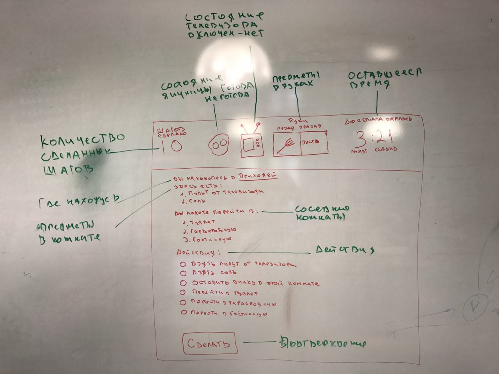
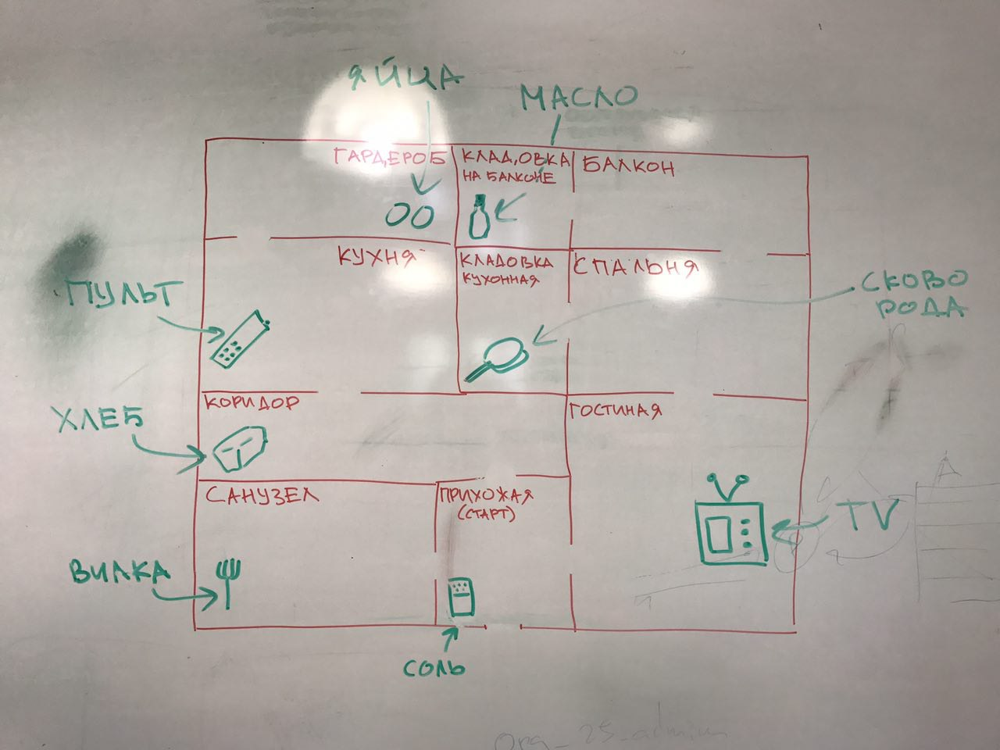

# omelette

## Задание

Написать текстовую игру. Условия и предметы игры можно менять по своему усмотрению.

## Технологии для реализации

1. Реляционная база данных (например, postgresql, mysql)
1. Фреймворк Yii2
1. Клиентский фреймворк Bootstrap или Foundation
1. Стили в виде SCSS

## Описание игры

Цель игры успеть приготовить яичницу и включить свой любимый сериал, которой начнётся через несколько минут. Игрок находится в помещении с несколькими комнатами. Комнаты соеденины проходами. В каждой комнате, включая стартовую, игроку предлагается выбор: перейти в одну из имежных комнат; взять предмет находящийся в этой комнате; оставить в этой комнате предмет находящийся у игрока в одной из рук;

## Интерфейс игры

1. Игра должна открываться в браузере.
1. Перед началом игры, пользователь вводит своё имя и название своего любимого сериала. И нажимает кнопку "Играть".
1. Далее открывается интерфейс игры, который состоит из:
    1. Шапки, в которой отображаются:
        1. Состояние телевизора (например, включен или выключен)
        1. Готовность яичницы (например, готова или не готова)
        1. Руки игрока (например, свободны или заняты одним или двумя предметами)
        1. Количество выполненных ходов (например, 16)
        1. Оставшееся время до начала сериала (наприме, 4:13)
    1. Рабочей области игры, состоит из следующих блоков
        1. Название и описание текущей комнаты (например, Название: Прихожая; Описание: От сюда начинается игра и здесь сидит кот)
        1. Список предметов находящихся в этой комнате (наприме, в этой комнате нет ничего интересного)
        1. Список смежных комнат, куда можно перейти из текущей
        1. Выбор действия, например:
            1. Пойти в зал
            1. Пойти в гардероб
            1. Оставить в этой комнате пульт от телевизора
    1. Подтверждение действия (например, Выбрать действие)

## Логика игры

##### Для того, что бы пожарить яичницу необходимо

1. Сковорода
1. Яйца
1. Масло
1. Игрок и все эти предметы должны находиться на кухне

##### Для того что бы включить сериал необходимо

1. Находиться в гостинной (где есть телевизор)
1. В одной из рук должен быть пульт

##### Для того что бы съесть яичницу необходимо

1. Игрок должен находиться в гостинной (там где есть телевизор)
1. Яичница должна быть в одной из рук
1. В другой руке должна быть вилка
1. Телевизор должен быть включен
1. В этой комнате должны находиться хлеб и соль

**Интерфейс игры**

**Карта помещений и предметов**

